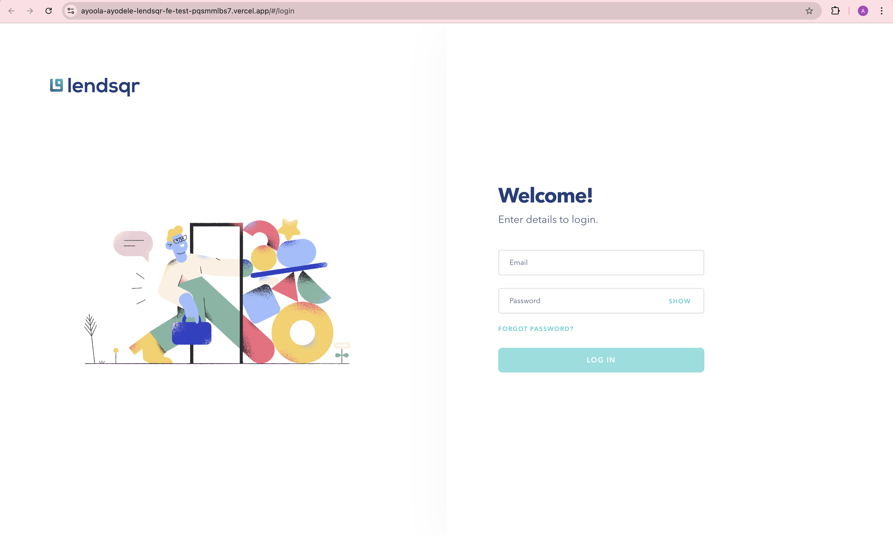
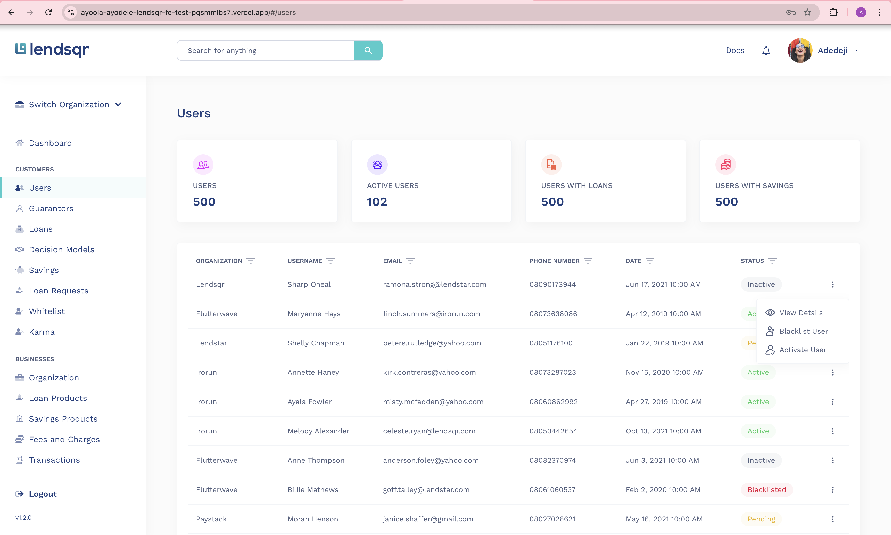
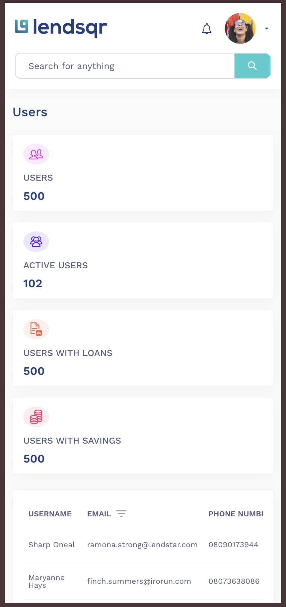
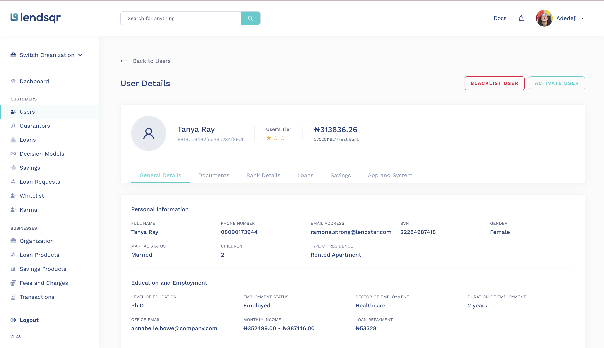
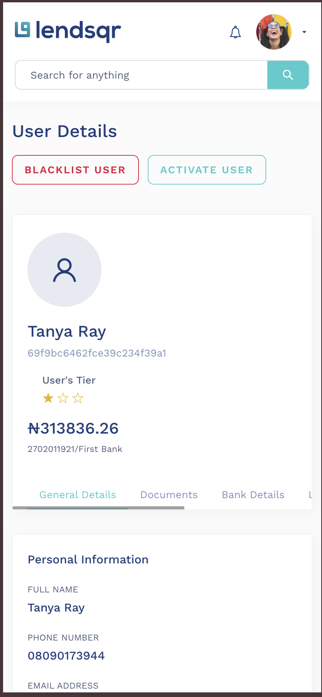

# lendsqr-fe-test

Lendsqr Admin Console — Frontend Engineering Assessment. A responsive admin dashboard that mirrors the Figma design with pixel-perfect fidelity, built with React, TypeScript, and SCSS.

---

## 🔗 Live Demo

**[View Live App](https://ayoola-ayodele-lendsqr-fe-test.vercel.app/)**

---


## 📸 Screenshots

### Login Page


### Users Dashboard


### Users Dashboard (Mobile)


### User Details


### User Details (Mobile)



## 🚀 Features

- **Login** — Email/password validation with Formik + Yup, password visibility toggle, disabled submit when invalid
- **Dashboard Layout** — Fixed topbar with debounced search, collapsible sidebar with customer/business/settings sections, organization switcher
- **Users Management** — Stats cards with live API data, sortable data table with 500 records, column-level filters (debounced text, select dropdowns, date picker), action menu with confirmation modals
- **User Details** — Profile card with tier stars and account balance, tabbed navigation, detailed sections (Personal Information, Education, Socials, Guarantor), localStorage caching
- **Responsive** — Optimized for desktop, tablet, and mobile with collapsing sidebar and reduced table columns

---

## 🛠 Tech Stack

| Category      | Technology                             |
|---------------|----------------------------------------|
| Framework     | React 19 + TypeScript 6                |
| Styling       | SCSS (Sass) with CSS Custom Properties |
| Routing       | React Router v7                        |
| Forms         | Formik + Yup                           |
| Data Fetching | TanStack React Query v5 + Axios        |
| Testing       | Vitest + React Testing Library + jsdom |
| Date Picker   | react-datepicker                       |
| Build Tool    | Vite                                   |
| Linting       | ESLint + Prettier                      |
| Mock API      | Mocki.io (500 users)                   |

---

## 📁 Project Structure

```
src/
├── app/                  # Router and providers
├── assets/               # Icons, images, fonts
├── components/
│   ├── layout/           # AppLayout, Sidebar, Topbar
│   └── ui/               # Button, Input, Modal, DataTable, StatsCard, Spinner, StatusBadge
├── features/
│   ├── auth/             # Login page, validation
│   ├── dashboard/        # Dashboard placeholder
│   └── users/            # Users page, user details
│       ├── api/          # API service functions
│       ├── components/   # UserProfileCard, UserDetailField, UserDetailSection
│       ├── data/         # Configs (stats, status, table columns, tabs)
│       ├── hooks/        # React Query hooks, useModal, useFilteredUsers, useUserStats
│       ├── pages/        # Page components
│       ├── storage/      # LocalStorage utilities
│       └── types/        # TypeScript interfaces
├── services/             # HTTP client
├── styles/
│   ├── base/             # Reset, globals
│   └── tokens/           # Colors, typography, spacing, breakpoints, effects
├── utils/                # Constants, formatters, error handler
└── tests/                # Test setup
```

---

## 🎨 Design Tokens

All styling is driven by CSS custom properties extracted from Figma. No hardcoded values.

- **Colors:** `--color-primary`, `--color-accent`, `--color-status-active`, etc.
- **Typography:** `--font-app` (Work Sans), `--fs-14`, `--fw-600`, etc.
- **Effects:** `--shadow-card`, `--shadow-sidebar`
- **Breakpoints:** `$bp-mobile: 480px`, `$bp-tablet: 768px`, `$bp-laptop: 1024px`

---

## ⚙️ Getting Started

### Prerequisites

- Node.js 18+ (v24.8.0 recommended)
- npm 9+ (v11.6.0 recommended)

### Installation

```bash
npm install
npm run dev
```

---

## 🧪 Testing

17 unit tests covering positive and negative scenarios:

| Test File                | Tests | Coverage                                                          |
|--------------------------|-------|-------------------------------------------------------------------|
| LoginPage.test.tsx       | 5     | Validation errors, password toggle, disabled button, valid submit |
| UsersPage.test.tsx       | 5     | Render, stats cards, loading state, error state, table data       |
| UserDetailsPage.test.tsx | 3     | Loading, user details, not found error                            |
| DataTable.test.tsx       | 4     | Headers, rows, empty state, pagination                            |

```bash
npm run test
```

---

## 📜 Available Scripts

| Command           | Description                 |
|-------------------|-----------------------------|
| `npm run dev`     | Start development server    |
| `npm run build`   | Build for production        |
| `npm run test`    | Run unit tests              |
| `npm run lint`    | Run ESLint                  |
| `npm run check`   | Run lint + test + build     |

---

## 🧱 Architecture Decisions

- **Feature-Based Architecture** — Each feature is self-contained with its own components, hooks, API, types, and data. Modules can be developed and tested independently.
- **Custom Hooks** — Business logic extracted into reusable hooks (`useTableFilters`, `useTablePagination`, `useUserStats`, etc.) keeping components focused on rendering.
- **Design Token System** — All visual properties are CSS custom properties, enabling consistent theming and eliminating hardcoded values.
- **Client-Side Processing** — With 500 records, filtering, sorting, and pagination happen client-side for instant responsiveness. Debounced inputs (400ms) prevent jank.
- **Local Storage Caching** — User details are persisted in localStorage to reduce redundant API calls on repeat visits.

---

## 📱 Responsive Design

| Breakpoint        | Layout                                                |
|-------------------|-------------------------------------------------------|
| Desktop (1280px+) | Full sidebar + 4-column stats grid                    |
| Laptop (1024px)   | Collapsed sidebar, 3-column stats                     |
| Tablet (768px)    | Hidden sidebar, 2-column stats, reduced table columns |
| Mobile (480px)    | Single column, essential columns only                 |

---

## ✍️ Commit Conventions

Commits follow [Conventional Commits](https://www.conventionalcommits.org/):

| Prefix       | Usage               |
|--------------|---------------------|
| `feat:`      | New features        |
| `fix:`       | Bug fixes           |
| `chore:`     | Maintenance         |
| `test:`      | Tests               |
| `style:`     | Styling             |
| `refactor:`  | Code restructuring  |

**Scopes:** `auth`, `users`, `ui`, `layout`, `styles`, `infra`
